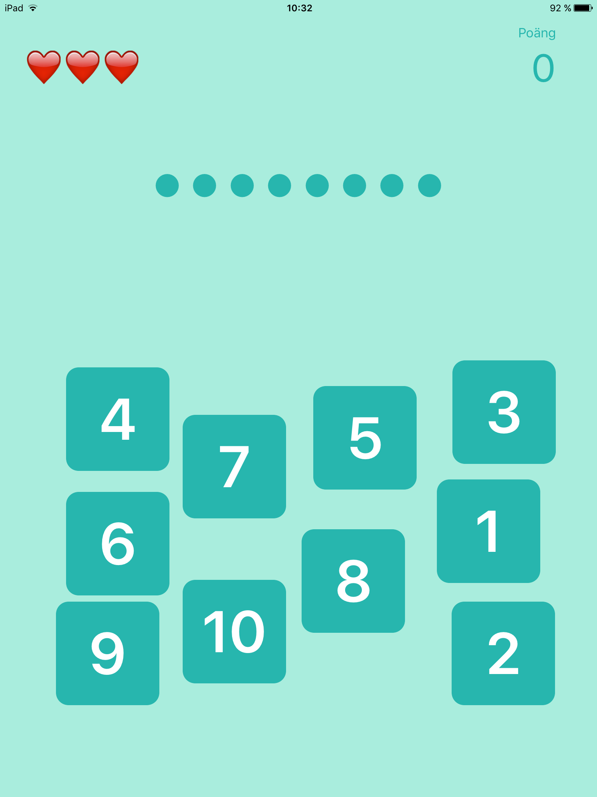

# Prick - räkna prickarna

**Prick** är ett litet spel för de yngre barnen som lär dig siffror. Räkna prickarna och välj motsvarande siffra.
Spelet är skrivit i Python och kräver Pythonista för iOS.

